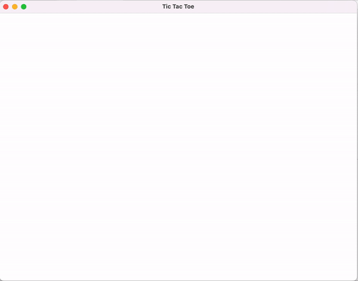

# kivy-games

**Tic-Tac-Toe** game application designed and developed in Kivy framework.

Read more about [Building Cross-Platform GUI Applications in Kivy](https://www.netguru.com/blog/building-cross-platform-gui-applications-in-kivy)
## Installation:
```
pip install kivy
```

## Usages:

```
python main.py
```

## Demo

<div align="center">
  
    
</div>


